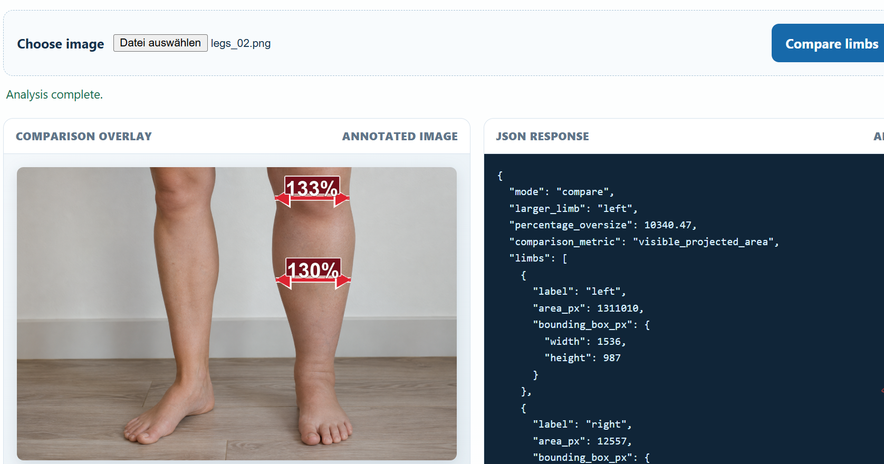
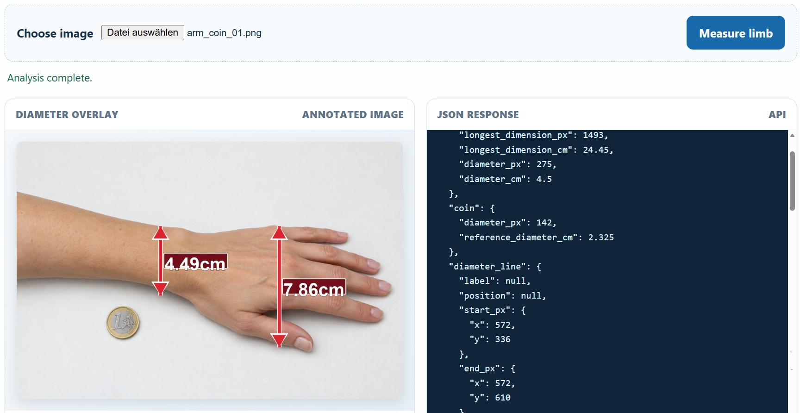
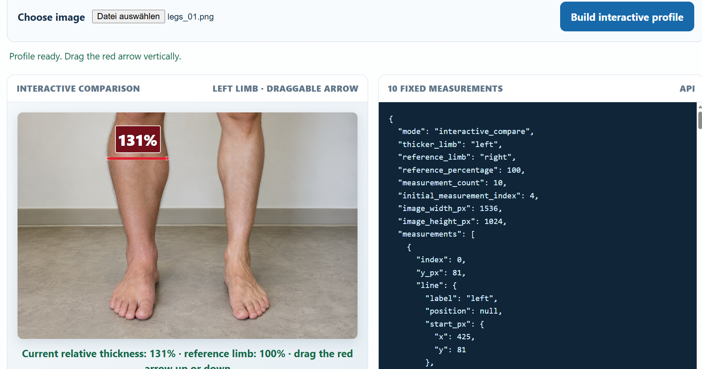

# Lymphimagen
This App is intended to test how to measure and compare limbs in case of swelling. This can be specially useful for cases of lymphoma diseases.

Estimates are based on visible image geometry and are not clinical measurements.

There are three Options:
1) Compare two limbs: comparison shows the over percentage of swelling using thinner limb as a reference for 100% limb normal thickness.
1) Measure with 1€: measurement in centimeters, using an 1€ coin as a reference
1) Interactive comparison: Allows to drag the red arrowed line up and down to get the different percentages of swelling.

In all cases The uploaded image is replaced with an annotated overlay showing one or two thick red line with double-ended arrows.

A JSON is shown next to the annotated image, with following information:
- Start/end pixel coordinates
- Bounding box
- Diameter in pixels
- Line width
- Diameter ratio
- Diameter percentage difference

Example:
```json
"diameter_comparison": {
  "metric": "visible_transverse_diameter",
  "larger_limb": "left",
  "percentage_oversize": 14.29,
  "ratio_larger_to_smaller": 1.143,
  "lines": [...]
}
```

## Setup
```powershell
python -m venv venv
.\venv\Scripts\Activate.ps1 
python -m pip install -r .\requirements.txt 

python -m uvicorn main:app --reload --host 127.0.0.1 --port 8000
```

## Image fixtures
### Synthetic images for automated testing
These deterministic PNGs are generated by `generate_fixtures.py` and are intended for automated API tests and local demos. They use simple, high-contrast silhouettes so failures are attributable to the analyzer rather than camera noise or an untracked external image.

| Fixture group | Files | Intended workflow |
| --- | --- | --- |
| Arms | `arms_01.png`, `arms_02.png` | Two separate arm silhouettes |
| Legs | `legs_01.png`, `legs_02.png` | Two separate leg silhouettes |
| Arm + coin | `arm_coin_01.png`, `arm_coin_02.png` | One arm plus a 1 EUR reference coin |
| Leg + coin | `leg_coin_01.png`, `leg_coin_02.png` | One leg plus a 1 EUR reference coin |

The coin diameter is encoded in the generator and equals 23.25 mm in the measurement model. Fixture geometry is illustrative only; it must not be interpreted as clinical ground truth.

Regenerate all images with:

```powershell
python tests/fixtures/generate_fixtures.py
```
### Realistic images
Even though these images have been generated using GenAI, they have a realistic look and can be used for visual testing.

Example: comparison of legs:


Example: measurement of an arm:


Example: interactive comparison of swelling percentage:
